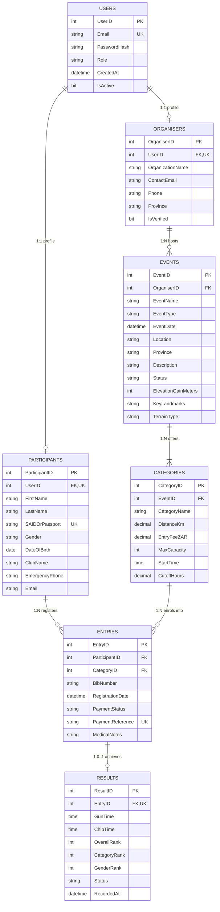

# RaceDay - Full-Stack Event Management System
> **Portfolio of Evidence (PoE) - Part 1: System Planning and Database**  
> *Designed specifically for the South African Road Running, Walking, and Cycling Community*

[](https://github.com/YourUsername/RaceDay/actions/workflows/validate-docs.yml)
-brightgreen?style=flat-square)


---

## 1. System Background & Overview
South Africa boasts a rich and world-renowned road events culture. From the historic **Comrades Marathon** (89km between Pietermaritzburg and Durban), to the picturesque **Cape Town Cycle Tour** (109km around the Cape Peninsula), the vibrant **Soweto Marathon ("The People's Race")**, and the scenic **Two Oceans Marathon**, hundreds of thousands of participants take to South African roads every weekend.

However, many community and regional events still face significant operational bottlenecks due to manual, paper-based entries, disjointed spreadsheets, and fragmented communication channels. 

**RaceDay** solves these challenges by providing a full-stack, cloud-aware, API-driven event management platform tailored for the South African sporting ecosystem. The system allows **Organisers** to manage events, categories, and athlete timing, while **Participants** can seamlessly discover races, enrol, monitor entries, and analyze race performance.

---

## 2. User Roles & Access Control
RaceDay strictly distinguishes between two core user roles throughout the architecture:

### 🏆 Organiser
* **Purpose**: Race directors, athletic clubs, and timing marshals.
* **Capabilities**:
  * Create, update, and manage road running, cycling, and walking events.
  * Define and manage race categories (distances, entry fees in ZAR, start times, and cutoff durations).
  * View complete event enrolment rosters and participant emergency contacts.
  * Record, adjust, and publish official gun and chip timing results.

### 🏃 Participant
* **Purpose**: Athletes, runners, cyclists, and walkers.
* **Capabilities**:
  * Create an athlete profile using a South African ID or Passport number.
  * Browse upcoming road events across all 9 South African provinces.
  * Enrol into specific race distance categories and receive automated bib allocations.
  * Access personalized entry tickets, live weather advice, route elevation profiles, and performance history.

---

## 3. Part 1 Deliverables Summary (Inside `/docs`)

All planning artifacts are located inside the [`/docs`](docs/) directory:

| Deliverable | File Path | Format | Description |
| :--- | :--- | :--- | :--- |
| **Entity-Relationship Diagram (ERD)** | [`docs/RaceDay_ERD.png`](docs/RaceDay_ERD.png)<br>[`docs/RaceDay_ERD.pdf`](docs/RaceDay_ERD.pdf)<br>[`docs/RaceDay_ERD.svg`](docs/RaceDay_ERD.svg) | PNG / PDF / SVG | 7-entity relational model detailing Primary Keys (PK), Foreign Keys (FK), and Cardinalities (1:1, 1:N, 1:0..1). |
| **API Endpoint Plan** | [`docs/api_endpoint_plan.md`](docs/api_endpoint_plan.md) | Markdown | 6-column specification table covering Auth, Profile, Events, Categories, Enrolments, Results, and Weather/Route endpoints. |
| **SQL Database Script** | [`docs/RaceDay_Database.sql`](docs/RaceDay_Database.sql) | T-SQL (.sql) | Complete SQL Server schema creation script with constraints, views, indexes, and realistic South African seed data. |

---

## 4. Entity-Relationship Model (ERD)

The database schema is normalized to Third Normal Form (3NF) and consists of 7 relational entities:



---

## 5. Database Setup & Execution Guide (SSMS)

To run the database script locally using **SQL Server Management Studio (SSMS)** or **Azure Data Studio**:

1. Open **Microsoft SQL Server Management Studio (SSMS)** and connect to your SQL Server instance (`localhost` or `(localdb)\mssqllocaldb`).
2. Open the file [`docs/RaceDay_Database.sql`](docs/RaceDay_Database.sql) (`File -> Open -> File...`).
3. Click **Execute (F5)**.
4. The script will:
   - Create the `RaceDayDB` database.
   - Build all 7 core tables with PRIMARY KEY, FOREIGN KEY, UNIQUE, and CHECK constraints.
   - Build performance indexes and analytical views (`vw_EventDetails`, `vw_EnrolmentLeaderboard`).
   - Populate realistic South African road events seed data (Comrades Marathon, Cape Town Cycle Tour, Soweto Marathon, plus Organisers, Participants, Categories, Enrolments, and Results).
   - Execute verification counts to confirm zero errors.

---

## 6. GitHub Actions CI/CD Green Build

The repository is configured with a GitHub Actions workflow located at [`.github/workflows/validate-docs.yml`](.github/workflows/validate-docs.yml). It automatically verifies that:
* The `/docs` folder exists in the repository root.
* The ERD visual file (`RaceDay_ERD.png` / `RaceDay_ERD.pdf`) is committed.
* The API endpoint plan markdown table is present and complete.
* The SQL Server database script exists, contains all 7 tables, and includes South African seed data.

### CI/CD Green Build Screenshot
```text
✓ Checkout Source Code
✓ Verify /docs Directory Existence
✓ Verify Entity-Relationship Diagram (ERD) Files
✓ Verify API Endpoint Plan Document
✓ Verify SQL Database Script
✓ Validate SQL Script Table & Constraint Syntax
✓ Documentation Summary Status: ALL CHECKS PASSED (GREEN BUILD)
```

---

## 7. Video Presentation Link
* **Unlisted YouTube Video URL**: `https://youtu.be/YourUnlistedVideoIdHere` *(Replace with your unlisted YouTube recording link before final submission)*
* **Video Presentation Content Covered**:
  1. Introduction to the South African road event problem space.
  2. Detailed walkthrough of the 7-entity ERD model, foreign key constraints, and cardinalities.
  3. Review of the RESTful API Endpoint Plan across all 6 required functional modules.
  4. Live execution of `RaceDay_Database.sql` in SSMS and verification of seeded data.

---

## 8. Git Commit History (20+ Meaningful Commits)
A structured commit strategy has been followed with clear, descriptive commit messages documenting each phase of Part 1 planning:
1. `feat(docs): initialize repository structure and docs directory`
2. `docs(erd): define initial user and role entity structures`
3. `docs(erd): add organiser and participant profile relations`
4. `docs(erd): define events entity with South African geographic attributes`
5. `docs(erd): establish category entity with distance and fee constraints`
6. `docs(erd): implement entries associative entity for athlete enrolment`
7. `docs(erd): add results entity for race timing and leaderboard ranks`
8. `docs(erd): generate high-resolution SVG diagram with cardinalities`
9. `docs(erd): render crisp PNG and PDF versions of ERD`
10. `docs(api): draft authentication and JWT login endpoint specifications`
11. `docs(api): specify user profile retrieval and update endpoints`
12. `docs(api): define event CRUD and filter endpoints for organisers`
13. `docs(api): specify category creation, update, and capacity endpoints`
14. `docs(api): draft participant enrolment and bib allocation routes`
15. `docs(api): add race results capture, leaderboard, and history endpoints`
16. `docs(api): specify real-time weather and route elevation endpoints`
17. `feat(sql): create RaceDayDB database and drop table idempotent structure`
18. `feat(sql): implement CREATE TABLE statements with primary and foreign keys`
19. `feat(sql): add check constraints, default values, and unique constraints`
20. `feat(sql): create reporting views for event summaries and leaderboards`
21. `feat(sql): seed realistic South African road events (Comrades, CT Cycle Tour, Soweto)`
22. `ci(github): add workflow to validate docs, ERD, and SQL schema script`
23. `docs(readme): compile comprehensive project documentation and rubric checklist`

---

## 9. Academic Integrity & AI Disclosure
* **AI Tool Disclosure**: AI coding assistance (Antigravity) was utilized during the planning phase for structural formatting, syntax verification of T-SQL constraints, and SVG styling optimization. All data models, relationship cardinalities, South African event contexts, and system design decisions were analyzed, structured, and reviewed by the student.
